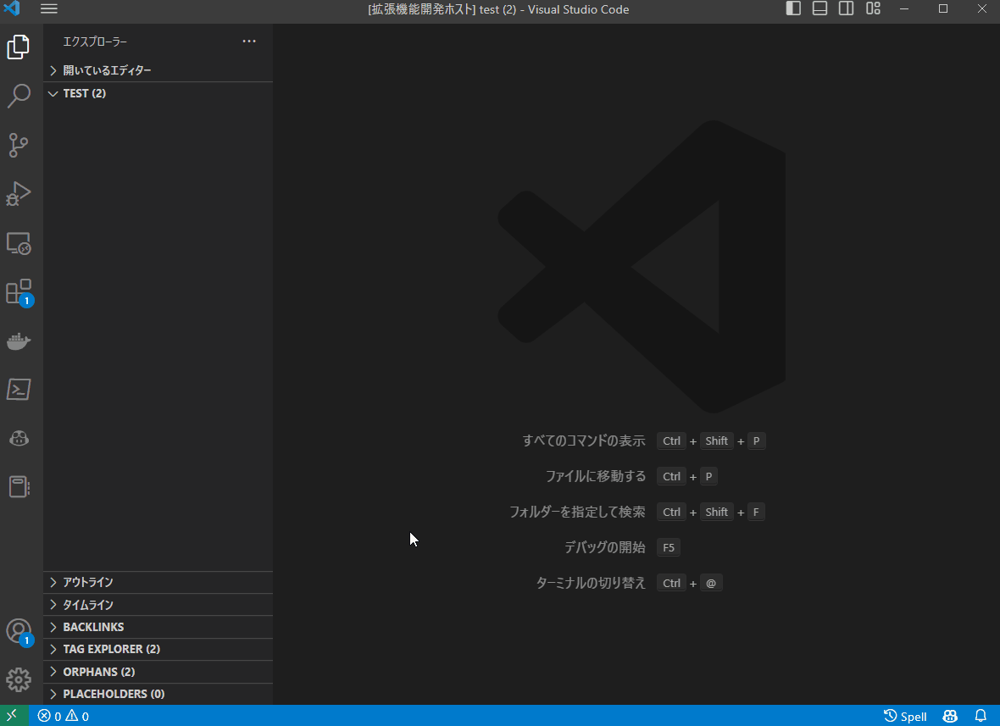

# vscode-note-taking-extension

create your note by a few click

## Feature
- initialize directory
- create markdown file
- markdown template
- create based on hierarchical categories
- batch conversion of image files contained in notes
  - WebP and AVIF

## PNG/JPEG vs WebP vs AVIF
**Notice:** bold text is default settings
**Notice:** Lossless mode of AVIF is something wrong @vips-8.14.1
**Notice:** see ./docs to check the processed images

### Large Nature Image
4288x2848

| Image   Type |   Quality    | File Size (KB) | File Size (bytes) | Compression Ratio |    MSE    |   SSIM    |
|:------------:|:------------:|:--------------:|:-----------------:|:-----------------:|:---------:|:---------:|
|     PNG      |     N/A      |   1132.87 KB   |   1160062 bytes   |        N/A        |    N/A    |    N/A    |
|              |              |                |                   |                   |           |           |
|     WebP     |      70      |   506.14 KB    |   518284 bytes    |       0.447       |  10.029   |   0.963   |
|     WebP     |      80      |   666.10 KB    |   682088 bytes    |       0.588       |   7.069   |   0.973   |
|   **WebP**   |    **90**    | **1101.81 KB** | **1128256 bytes** |     **0.973**     | **3.073** | **0.986** |
|     WebP     |     100      |   2248.57 KB   |   2302538 bytes   |       1.985       |   2.063   |   0.989   |
|   **WebP**   | **Lossless** | **6251.64 KB** | **6401676 bytes** |     **5.518**     | **0.000** | **1.000** |
|              |              |                |                   |                   |           |           |
|     AVIF     |      50      |   365.08 KB    |   373843 bytes    |       0.322       |   8.556   |   0.971   |
|     AVIF     |      60      |   522.28 KB    |   534818 bytes    |       0.461       |   4.683   |   0.983   |
|     AVIF     |      70      |   616.11 KB    |   630899 bytes    |       0.544       |   3.015   |   0.988   |
|     AVIF     |      80      |   733.31 KB    |   750908 bytes    |       0.647       |   1.982   |   0.992   |
|   **AVIF**   |    **90**    | **1028.01 KB** | **1052681 bytes** |     **0.907**     | **0.516** | **0.997** |
|     AVIF     |     100      |   5420.01 KB   |   5550091 bytes   |       4.784       |   0.000   |   1.000   |
|     AVIF     |   Lossless   |   5420.01 KB   |   5550091 bytes   |       4.784       |   0.000   |   1.000   |

### Medium Nature Image
1000x664

| Image   Type |   Quality    | File Size (KB) | File Size (bytes) | Compression Ratio |    MSE     |   SSIM    |
|:------------:|:------------:|:--------------:|:-----------------:|:-----------------:|:----------:|:---------:|
|     PNG      |     N/A      |   827.16 KB    |   847011 bytes    |        N/A        |    N/A     |    N/A    |
|              |              |                |                   |                   |            |           |
|     WebP     |      70      |   101.36 KB    |   103796 bytes    |       0.123       |   25.139   |   0.948   |
|     WebP     |      80      |   128.26 KB    |   131338 bytes    |       0.155       |   18.918   |   0.962   |
|   **WebP**   |    **90**    | **199.90 KB**  | **204694 bytes**  |     **0.242**     | **10.033** | **0.979** |
|     WebP     |     100      |   348.17 KB    |   356526 bytes    |       0.421       |   5.752    |   0.988   |
|   **WebP**   | **Lossless** | **883.41 KB**  | **904608 bytes**  |     **1.068**     | **0.000**  | **1.000** |
|              |              |                |                   |                   |            |           |
|     AVIF     |      50      |    81.98 KB    |    83948 bytes    |       0.099       |   25.472   |   0.946   |
|     AVIF     |      60      |   115.73 KB    |   118510 bytes    |       0.140       |   17.027   |   0.964   |
|     AVIF     |      70      |   142.72 KB    |   146142 bytes    |       0.173       |   13.020   |   0.973   |
|     AVIF     |      80      |   176.78 KB    |   181025 bytes    |       0.214       |   9.861    |   0.979   |
|   **AVIF**   |    **90**    | **322.27 KB**  | **330004 bytes**  |     **0.390**     | **2.362**  | **0.992** |
|     AVIF     |     100      |   767.77 KB    |   786194 bytes    |       0.928       |   0.000    |   1.000   |
|     AVIF     |   Lossless   |   767.77 KB    |   786194 bytes    |       0.928       |   0.000    |   1.000   |

### Game Image
1920x1080

| Image Type | Quality      | File Size (KB) | File Size (bytes) | Compression Ratio | MSE       | SSIM      |
|------------|--------------|----------------|-------------------|-------------------|-----------|-----------|
| PNG        | N/A          | 3013.41 KB     | 3085727 bytes     | N/A               | N/A       | N/A       |
|            |              |                |                   |                   |           |           |
| WebP       | 70           | 161.32 KB      | 165190 bytes      | 0.054             | 17.515    | 0.937     |
| WebP       | 80           | 212.03 KB      | 217120 bytes      | 0.07              | 14.072    | 0.950     |
| **WebP**   | **90**       | **344.91 KB**  | **353188 bytes**  | **0.114**         | **9.325** | **0.966** |
| WebP       | 100          | 702.09 KB      | 718938 bytes      | 0.233             | 6.704     | 0.976     |
| **WebP**   | **Lossless** | **2169.37 KB** | **2221434 bytes** | **0.720**         | **0.000** | **1.000** |
|            |              |                |                   |                   |           |           |
| AVIF       | 50           | 112.22 KB      | 114912 bytes      | 0.037             | 16.555    | 0.941     |
| AVIF       | 60           | 164.76 KB      | 168716 bytes      | 0.055             | 12.460    | 0.955     |
| AVIF       | 70           | 209.40 KB      | 214428 bytes      | 0.069             | 10.482    | 0.962     |
| AVIF       | 80           | 269.46 KB      | 275932 bytes      | 0.089             | 8.809     | 0.967     |
| **AVIF**   | **90**       | **586.83 KB**  | **600909 bytes**  | **0.195**         | **1.929** | **0.989** |
| AVIF       | 100          | 1923.83 KB     | 1969998 bytes     | 0.638             | 0.328     | 0.998     |
| AVIF       | Lossless     | 1923.83 KB     | 1969998 bytes     | 0.638             | 0.328     | 0.998     |

### Simple Screenshot Image
1419x1001

| Image   Type |   Quality    | File Size (KB) | File Size (bytes) | Compression Ratio |    MSE    |   SSIM    |
|:------------:|:------------:|:--------------:|:-----------------:|:-----------------:|:---------:|:---------:|
|     PNG      |     N/A      |   166.84 KB    |   170846 bytes    |        N/A        |    N/A    |    N/A    |
|              |              |                |                   |                   |           |           |
|     WebP     |      70      |    92.34 KB    |    94556 bytes    |       0.553       |   8.708   |   0.980   |
|     WebP     |      80      |   109.00 KB    |   111618 bytes    |       0.653       |   7.129   |   0.984   |
|   **WebP**   |    **90**    | **144.01 KB**  | **147462 bytes**  |     **0.863**     | **5.616** | **0.988** |
|     WebP     |     100      |   211.52 KB    |   216596 bytes    |       1.268       |   4.795   |   0.991   |
|   **WebP**   | **Lossless** |  **41.52 KB**  |  **42520 bytes**  |     **0.249**     | **0.000** | **1.000** |
|              |              |                |                   |                   |           |           |
|     AVIF     |      50      |    37.37 KB    |    38267 bytes    |       0.224       |   5.918   |   0.987   |
|     AVIF     |      60      |    44.04 KB    |    45094 bytes    |       0.264       |   5.412   |   0.989   |
|     AVIF     |      70      |    48.96 KB    |    50131 bytes    |       0.293       |   5.219   |   0.990   |
|     AVIF     |      80      |    56.46 KB    |    57816 bytes    |       0.338       |   5.073   |   0.990   |
|   **AVIF**   |    **90**    | **100.50 KB**  | **102907 bytes**  |     **0.602**     | **0.410** | **1.000** |
|     AVIF     |     100      |   159.44 KB    |   163267 bytes    |       0.956       |   0.095   |   1.000   |
|     AVIF     |   Lossless   |   159.44 KB    |   163267 bytes    |       0.956       |   0.095   |   1.000   |

